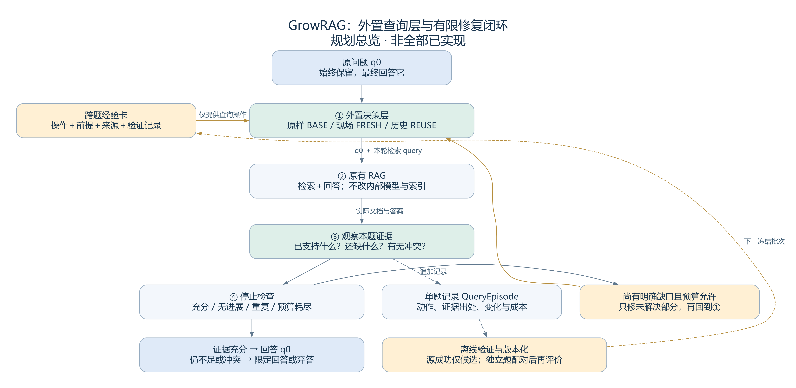
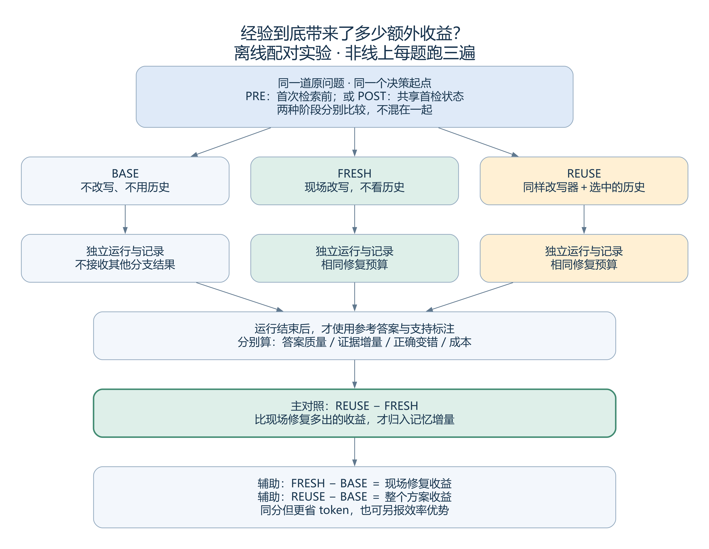

# GrowRAG：查询侧可信经验复用的项目构思

从 DG-RAG 的外置层思路，到可检验、可停止的记忆修复闭环

日期：2026-09-07。用途：供项目成员独立理解研究动机、模块设计、文献关系与实施顺序；不是已经写好的论文，也不是效果承诺。

后续专题：[长期持有、浅层派生与跨任务评价](../knowledge/decisions/2026-09-07_经验持有价值_浅层派生与跨任务评价.md)。进一步区分临时使用/长期执行、原始来源与递归摘要，以及冻结评价/流式更新；具体深度上限与新规则仍是待验证建议。

本文综合历轮讨论和当前代码，区分三种身份：**已确定的方向、借鉴前人的机制、需要实验验证的假设**。全文中的“可信”“安全”指可审计的经验质量与使用风险控制，不是数学保证。文献正文按模块引用；[完整历史文献索引](GrowRAG_构思文档_历史文献索引_2026-09-07.md)覆盖四批阅读包及后续补充，不意味着本轮重新逐字阅读了全部全文。

## 先用一分钟理解我们想做什么

普通 RAG 收到一个问题，检索文档，再根据文档回答。GrowRAG 希望在它外面放一个小助手：

> 先判断原问题是否需要换一种检索表达；有合适的历史查询经验就借用，没有就保持原样，或现场重新想一个查询。检索后检查还缺什么，有必要才再修一次。最后把可核查的操作和结果留下，但不把每一次答对都变成永久可信经验。

这里的记忆主要记“怎样找”，不是“以前的答案是什么”。最终答案始终回答原问题，事实依据来自本题实际检索到的文档。

我们要共同研究两个相连的问题：

1. **什么时候值得用经验？** 它在当前题上，是否比不看历史、现场改写更有帮助？
2. **经验应该怎样记？** 哪些具体修改与必要前提必须留下，才能让系统判断得更准，又不增加过多上下文？

当前适合把它定位为“查询修复经验的表示与选择”这一方法型研究，不宜先宣称新范式。Agent 循环、查询改写、双层记忆、QPP 都已有前人；论文价值必须落到一个明确机制和可重复的验证上。

## 1. 起点：从 DG-RAG 获得什么启发

按照你的描述，DG-RAG 给我们的启发是：**尽量不侵入原 RAG 内部，在前面增加一个可关闭的补充层。** 本文将它作为你的项目经验来源；目前没有足够原始材料确认 DG-RAG 的完整算法、正式论文标题或发表信息，因此不代填这些内容。以后写论文相关工作时，应补你的原稿或公开链接。

GrowRAG 延续“外置”的工程立场，但把一次性前处理扩展为首尾相接的有限循环：

```text
外置查询层 → 原有 RAG → 返回文档与答案 → 外置层判断是否再修复
```

“低耦合”不是零接口要求。底座至少需要接受两个不同的东西：原问题 q0 与本轮搜索 query；并返回实际证据及其来源。否则，把“作者的学校”改成一个短检索词以后，回答器可能误把短词当最终问题。

| 我们尽量不动什么 | 我们确实会改变什么 |
|---|---|
| 文档切块、索引、基础检索器、回答模型参数 | 发出的检索 query、执行次数、何时使用历史、何时停止 |
| 原问题及其约束 | 本轮检索表达，可以更短、更明确或补充当前已验证的信息 |
| 原 RAG 的内部推理实现 | 外部调用流程和观测记录 |

因此它可以适配普通 RAG，也可能适配图 RAG；但不能在没有适配和实验的情况下声称支持任意 RAG。如果底座只返回答案、不提供文档，最多做弱的答案检查，不能声称完成证据级充分性验证。

这一位置与 [Query Rewriting in Retrieval-Augmented Large Language Models（EMNLP 2023）](https://aclanthology.org/2023.emnlp-main.322/) 的思路相通：它调整查询以适配冻结的检索和阅读组件，也探索用 Reader 反馈训练小改写器。**“不训练底座，只改查询”不是我们的新贡献。**

## 2. 总体架构：一个外置控制器，而不是不断堆 Agent



图 1 是目标设计，不表示每个模块都已接通。实线表示本题运行；虚线表示记录和跨题验证。正式评测期间经验库冻结，不能一边看考试答案、一边更新给下一题用。

### 2.1 我们从 ReAct 借鉴什么

[ReAct](https://arxiv.org/abs/2210.03629) 将推理、行动和外部观察交替起来。放在这里，就是“看当前缺什么 → 发起一次搜索 → 看新证据 → 决定下一步”，而不是先写出一整套计划后不再检查。

GrowRAG 可以成为轻量的 Agentic RAG：控制器能根据观察改变下一步。但不必设计多个会互相讨论的 Agent，也不要求存完整 CoT。我们优先保留可核查的决策摘要、实际动作与证据出处。**ReAct 提供运行思想，不直接提供我们要验证的跨题记忆收益。**

### 2.2 用统一语言描述三种选择

| 名称 | 通俗含义 | 历史是否参与 |
|---|---|---|
| BASE | 直接用原查询运行基础 RAG；作为“不修复”的对照 | 否 |
| FRESH | 只根据当前题和当前可见信息，现场生成新查询 | 否 |
| REUSE | 在同样的改写任务中，再提供选中的历史查询经验 | 是 |

FRESH 不等于“改写后的 query”这个文本，而是一种生成方式。REUSE 也不是直接复制旧问题；它应当把旧操作绑定到本题的对象和约束上。

Query variant 就是同一道问题的不同检索表达版本。这里的 query 是交给检索器的搜索请求；它可以变，但最终要回答的问题 q0 不变。

首次检索前的 FRESH 只能使用 q0，不能假装已经知道缺失证据；首次检索后的 FRESH_REPAIR 可以使用已经检索到的文档与缺口。两种阶段分别记为 PRE 和 POST，来源卡不能仅修改标签就从一个阶段变成另一个阶段。

### 2.3 两个关闭开关要分开

- 关闭整个补充层：回到一次基础 RAG。
- 只关闭跨题经验：仍可保留同样的现场 FRESH 修复和停止规则。

后一个开关是我们的关键对照。若移除记忆后系统依然同样好，就不能把好效果全部归到记忆模块。

### 2.4 是否需要状态机

需要明确状态和合法出口，但首版用简单的有限循环即可：观察 → 选择 → 执行 → 检查 → 继续或停止。状态机的作用是让预算耗尽、证据冲突和异常都有出口，不让模型随意无限调用工具；它不是论文创新本身。

AWM（Agent Workflow Memory）主要启发我们从经历提炼可复用工作流，并不等同于通用“状态机”这个实现概念。MemCon 则启发如何选择记忆行动。GrowRAG 先把本题运行和跨题记忆维护分开：前者决定搜索与回答，后者在离线验证后更新卡片，避免每次回答同时合并、删除、压缩一遍整个库。相关原文入口见[历史索引](GrowRAG_构思文档_历史文献索引_2026-09-07.md)。

## 3. 模块一：经验该怎样存，才能帮助判断“这次能不能用”

### 3.1 先区分单题记录、跨题经验和后置的文档记忆

| 对象 | 解决什么问题 | 保存什么，以及为什么放这里 |
|---|---|---|
| QueryEpisode，单题经历 | 这道题究竟发生过什么？ | q0、实际查询、动作顺序、当时已知信息、证据指针、结果与成本。用于复查经过，不必整段送进下一题 prompt |
| ExperienceCard，跨题经验卡 | 哪个可复用的查询操作值得尝试？ | 紧凑修改方式、必要前提、不可丢的约束、来源和版本。用于选择与改写，不存一份新的事实知识库 |
| DocumentSession，文档会话 | 同一篇文档里，哪些位置和术语已经熟悉？ | 该文档版本内有出处的别名、章节导航、局部歧义。只在文档范围生效；首版后置，不为了“三层”而强行加入 |

QueryEpisode 的最小单位是一道问题，不是整篇文档。一个 episode 可以有几个检索步骤。文档结束冻结 DocumentSession、问题结束冻结 episode；冻结指保存不可变记录，不意味着把尚未核实的内容永久认证为正确。

[Useful Memories Become Faulty](https://arxiv.org/abs/2605.12978) 是具体经历与压缩长期记忆的重要参照：反复加工成功经历也可能损失适用前提。我们保留不可变来源，不用新摘要覆盖旧经历。**双记忆、分层和保留来源本身不能作为首创。**

### 3.2 已确认：统一外壳，不同动作正文

“统一外壳”是所有经验共有的管理字段；“不同正文”是具体操作的表达方式。语义改写、扩写和拆分不必硬塞进同一个缺口模板。

建议的最小内容如下。它是概念设计，不是声称所有字段已经进入当前代码。

| 信息组 | 建议内容 | 必须保存的理由 | 给谁看 |
|---|---|---|---|
| 身份与来源 | card_id、版本、源题/源步骤、原始记录指针 | 能追查概括是否失真，防止同源题充当迁移成功 | 管理器与审计 |
| 动作身份 | PRE/POST、改写形式、修改目的 | 避免把依赖首检证据的操作提前使用；避免把扩写当同义改写 | 选择器与改写器 |
| 适用前提 | 必要角色、已知/未知项、允许范围 | 判断当前有没有执行这个操作的条件 | 选择器；给改写器最少必要部分 |
| 动作正文 | 一对短查询或角色化操作示例、最少说明 | 不只说“请改得更好”，而是告诉模型实际改哪里 | 改写器 |
| 保留约束 | 本操作不能删掉的时间、否定、实体范围、关系方向等 | 防止检索变容易了，却已经换了一道问题 | 改写器与检查器 |
| 验证记录引用 | 源题增量、独立题 REUSE−FRESH、伤害、费用、配置范围 | 可靠度应来自记录，而不是卡片自己写“我很可靠” | 选择器与离线评价，不整本喂给改写器 |

正文不直接保存旧答案作为下一题证据。原始查询和例子也可能含事实线索，所以“删掉 answer 字段”还不够：还需检查源题与目标题重复、实体重叠和旧值照搬。

### 3.3 一个例子：记操作与前提，不记旧答案

以下是占位示意，不是实验结果，也不是已入库的有效卡。

```text
场景：问题问某作品的创作者毕业于哪所学校。
当时已有：当前证据已经唯一确认创作者。
仍然缺少：该创作者的毕业学校。

操作前：[作品] 创作者 毕业学校
操作后：[当前已确认创作者] 毕业学校

必要前提：创作者身份有本题证据，而不是来自旧答案或模型猜测。
保留约束：原问题若限定年代、角色或身份，不得删掉。
```

新问题换成电影导演，可以研究这项操作能否迁移；但当前连导演是谁都不知道时，不能跳过前提，猜一个人名填进去。

这正是 reliability 与 applicability 分开的原因：前者问“这个操作在已验证条件下历史上表现怎样”，后者问“当前状态是否满足这些条件”。历史表现好不保证现在适用；现在形式上适用也不保证比 FRESH 好。

### 3.4 不预先宣布哪种笔记一定最好

我们应固定同一批来源，比较几种“写法”，而不是分别建不同质量的库：

1. 原始查询对：具体，但可能照搬旧实体。
2. 角色化查询对：把旧人名等替换为当前角色，检验去实体化的作用。
3. 抽象规则：短，但可能抽象过宽。
4. 角色化实例＋最少必要前提：候选方案，检验前提是否真正帮助选择。

控制相同候选经验、基础模型、生成预算，并报告笔记 token。不能把“多给了一大段解释”的优势误称为结构优势。

[ReFormeR](https://arxiv.org/abs/2604.01417) 已从成功查询改写中提取和复用模式，是直接基线；[QCR](https://arxiv.org/abs/2608.12847) 已研究目标条件化的短笔记、重新绑定和拒绝复用条件。我们的研究必须进一步证明：**在查询检索任务中，哪些最少字段能预测相对 FRESH 的收益；删除或压缩哪些字段，会系统性地产生错误迁移。** 不只是重新给已有字段起名字。

### 3.5 与 GAM-RAG 的关系

[GAM-RAG](https://arxiv.org/html/2603.01783v1) 给句子维护任务/时间记忆状态和不确定性，根据证据判断进行 Kalman 式更新；尤其谨慎对待“未被判为有效”的反馈，以免过早压低桥接证据的价值。我们借鉴这种对噪声反馈的保守处理，研究的单位则是“某个查询操作在某个条件范围内的迁移表现”，不是句子本身的价值。GAM-RAG 也已有不同问题上的实验；跨题评价不是它没有考虑过的内容。

## 4. 模块二：什么经验值得录入，什么证据可以给它记功

### 4.1 把三个判断拆开

**第一层：源题是否成功。** 答案是否正确？是否真正取得了有用文档？修改是否保留原意？这决定源经历能否成为候选材料。

**第二层：成功是否与这个操作有关。** 也许不改写就已经正确；也许模型随机答得更好；也许只删掉一个词就有同样检索结果。不能把整段模型总结都当成有效机制。

**第三层：在独立新题上是否比 FRESH 更好。** 这才开始回答“经验是否具有额外迁移价值”。源题成功只能支持第一层，不能直接替代第三层。

[ERM / RAG without Forgetting](https://arxiv.org/html/2602.05152v1) 的验证后更新思想值得借鉴，但其经验写入文档检索表示，我们保留为外部查询操作。它使用检索正确或生成正确的录入门，并将扩写拆为原子单元，按文档 key 的相似度增量分配更新。因此成功录入、局部贡献判断都已有覆盖；其相似度增量代理与我们计划测量的实际 REUSE−FRESH 不同，不能因此说它没有归因思想。

### 4.2 两层反馈并行记录，不压成一个万能分数

| 反馈 | 具体问什么 | 不能推出什么 |
|---|---|---|
| 证据层 | 是否补到目标实体、属性、关系或必要证据跨度？能否追溯到真实文档？是否引入矛盾？ | 新文本更多不等于有用；支持某一项不等于足以回答整题 |
| 答案层 | 最终回答是否正确？其中事实是否由给定证据支持？是否合理弃答？ | 答对不等于检索成功，模型可能靠已有知识回答 |

有 gold 时，先用答案 EM/F1 和支持事实标注做离线评价。EM 是规范化后完全匹配；F1 衡量词级重合。支持事实召回衡量标注所需证据找回多少；它不能完整替代语义蕴含，而且标注未必列出所有合法证据。

没有 gold 时，可以检查出处、需求覆盖和回答蕴含，也可用固定模型 judge 辅助；但这些是可能出错的代理标签。第一阶段不要自动把它们升级为长期 trusted，也不必立即上强化学习：**训练算法不能凭空补出可靠的奖励标准。**

### 4.3 建议的渐进录入流程

```text
保存真实来源记录
  → 检查源题操作与反馈
  → 形成候选卡（不是 trusted）
  → 在独立训练题上做 REUSE / FRESH 配对
  → 积累收益、退化和不确定性
  → 在已经验证的适用范围内供选择器使用
```

目前沿用成功来源优先，不从失败源题主动提炼建议。但成功卡在新题上失败的事件必须记下来；这不违背“先只用成功来源”的选择。

录入强度分阶段，不同时加十个苛刻门槛。首版保留来源正确性、可追溯性、原意保持和独立评价；更严格的“必须有新支持”“必须答案增益”等规则做消融，观察是否把可用经验过滤光。

当前代码的源卡录入主要使用 FRESH 相对 BASE 的改善和不退化条件。它证明的是来源有候选价值；**它还不是独立题 REUSE−FRESH 的可信认证。**

### 4.4 为什么动态可靠度不等于“常用的排前面”

可靠度最好从独立反馈事件计算，同时保留样本量、适用范围和伤害次数。被调用很多只代表热门，不代表有用；同题重复跑十遍也不是十个独立问题。

多级队列可以用于管理候选、有限验证、降级和冷归档。冷归档是从高频候选池移出、保留可追溯记录，不是抹去负结果。合并重复卡时保留来源并重新检查范围，不能直接继承两张卡成功率的最大值。

[RRM](https://arxiv.org/html/2607.28156v1) 的适用条件、证据要求、失败模式与生命周期，是主要参考。[MemCon](https://arxiv.org/html/2607.13591v1) 将检索、重新检索、注入、合并、遗忘和 NoOp 等作为受控行动，用轻量 bandit 学习动作价值。我们借鉴职责划分：本题控制器管搜索与修复，记忆管理器管合并、降级和归档；不必把所有维护动作挤进每轮检索决策。

[ReMe / Remember Me, Refine Me](https://aclanthology.org/2026.findings-acl.829/) 又提供正式发表的直接参照：对比成功/失败经历、用 judge 验证、场景检索与重排、面向当前任务改写，以及依据使用效用淘汰。不能把“结构化条件＋动态可靠度＋淘汰”本身归为我们的新设计；RRM 与 ReMe 是两篇不同工作。

EMA（指数移动平均）以后可用于近期效果趋势：新估计 = (1−α)×旧估计＋α×本次经过验证的反馈。α 越大，近期结果影响越大。它不代表真值置信概率，也不是“不使用就必然失效”的规则。若要按时间衰减，应优先对近期相关性或不确定性建模，而不是无证据地把陈旧经验判错。GAM-RAG 的 Kalman 式不确定性更新不能直接等同于 EMA。

经验压缩、动作改写、模型或检索环境显著变化后，旧验证只支持旧版本；新版本重新检查。共享的环境配置集中保存，不在每张卡里复制几十项参数。

## 5. 模块三：遇到新题，什么时候调用哪一条经验

### 5.1 真正要预测的不是“题难不难”

[Adaptive-RAG](https://aclanthology.org/2024.naacl-long.389/) 的复杂度路由有启发：不是每题都需要同样重的流程。但问题复杂度与历史收益不同。难题可能没有任何可用经验；简单题也可能因一个特定术语映射受益。

我们希望预测的是：

> 在当前可见状态、候选经验和预算下，使用它相对现场 FRESH，可能多得到多少帮助，又有多大机会把结果改坏？

这是用过去独立训练题的配对结果来学习或校准的预测，不能在新题尚未运行时得到保证。先做结果、后评价用于离线造标签；线上只能使用决策时已经可见的特征。

### 5.2 四步选择：召回不等于批准使用

| 步骤 | 最小做法 | 所解决的问题 | 参考脉络 |
|---|---|---|---|
| 1. 找候选 | 按问题/操作描述召回少量卡 | 减少搜索整个记忆库的成本 | ReFormeR、RRM 等经验检索 |
| 2. 检查能不能用 | 阶段、动作、角色、必要证据、版本、同源隔离 | 相似但不适用的经验先排除 | RRM 条件/证据需求；QCR 重新绑定与适用检查 |
| 3. 估计值不值得用 | 独立反馈、当前状态、QPP 等预测收益与退化风险 | 能执行不等于优于 FRESH | QPP query variant selection；历史收益与不确定性研究 |
| 4. 执行或放弃 | 选一条卡；无合适卡时允许 BASE / FRESH | 不被迫使用一段历史 | ExpWeaver 的可选经验思想；自适应路由 |

这里的 [ExpWeaver：Rethinking Experience Utilization in Self-Evolving Language Model Agents](https://arxiv.org/html/2605.07164v1) 把经验作为按需调用资源，并探索训练调用行为；它还在请求经验的位置移除经验、与随机调用位置比较，实验包含 HotpotQA。不要与 [ExpWeaver: LLM Agents Learn from Experience via Latent RAG](https://arxiv.org/abs/2606.01041) 混淆：后者在模型内部进行隐状态经验检索与融合，历史审计核为 ICML 2026；前一篇本轮只核到预印本。

目前最小实现先用非常有限的模式匹配做候选诊断，不是这四步完整的智能控制器。自然语言条件写在卡上，不代表代码已经正确理解了它。

环境适配也分轻重：接口/动作不支持属于硬阻断；索引、模型或 prompt 版本变化可以先降为待重新校准。不要要求世界上所有变量完全相同才允许迁移，否则经验没有跨题价值；也不能把一串配置哈希当作效果不变的证明。

### 5.3 QPP 可以放在哪里

QPP 是 Query Performance Prediction，查询性能预测。它估计一个查询可能检索得怎样，**不天然等于预测答案正确，更不自动等于预测记忆的额外收益**。[Can QPP Choose the Right Query Variant?（SIGIR 2026）](https://doi.org/10.1145/3805712.3808571) 是我们选择查询版本的重要直接参照。

| 可使用的时点 | 能看到什么 | 不能冒充什么 |
|---|---|---|
| 检索前 QPP | 已经形成的 query、长度、词项统计等无需取得该 query 结果的特征 | 未检索到的 top-k 分布、未来支持增量 |
| 检索后 QPP | 该 query 实际检出的分数、结果分布等 | 零检索成本的前置判断 |
| 经验收益预测 | 当前状态、卡片条件、历史独立反馈，可加 QPP 特征 | 已经确认新题 REUSE 比 FRESH 更好 |

若先分别生成 FRESH 和 REUSE query，再用检索前 QPP 选一个，可以少执行一个后续检索，但已经付出了两个候选的生成成本。若想连这部分也省下，就必须在生成前预测“选择这个操作可能有用”，那是动作收益预测，不应直接称为标准的候选 query QPP。

首版建议比较：相似度选择、条件选择、QPP-only、条件＋QPP。先证明新信号有增量，再考虑训练小模型。与 RAG utility/answer-quality prediction、检索增益预测等近邻的关系，也列入历史索引，不能把“预测相对收益”笼统宣称为首次。

特别注意，QPP 论文的 QSD(Pre) 已利用语义相近历史查询的效果进行预测。因此“加上历史近邻就能提前预测”不是空白；我们需要检验的是特定经验相对 FRESH 的迁移增量与伤害，是否能由必要前提提供额外信号。另需统一 Reader 输入：若对照论文把改写后的问题也交给回答器，而我们始终让它回答 q0，就不是可以直接搬用其分数的设置。[QPP 方法原文 §3](https://arxiv.org/html/2604.22661v1)

### 5.4 放弃经验不等于放弃修复

当前试验无卡可以走 BASE，以便控制成本。未来闭环中，证据不足而经验不适用时，应能走 FRESH；充分时直接回答；无法继续时停止并报告不足。不要让“找不到经验”成为系统唯一的停止逻辑。

## 6. 模块四：如何规范地改写，而不只处理结构缺失

我们把“是否用历史”“改写形式”“修改目的”拆成三个不同维度：

```text
信息来源：FRESH / REUSE
改写形式：语义改写 / 扩写 / 拆分 / 加约束 / 抽象化
修改目的：表达对齐 / 消歧 / 找桥接实体 / 补属性 / 补关系 / 核查冲突
```

语义改写可以只改善搜索表达，不要求问题本身缺少信息。缺口也不一定是用户把题问坏了，常常是我们的检索证据尚未覆盖它。

| 形式 | 通俗例子 | 相关工作与边界 |
|---|---|---|
| 语义改写 | 把口语长问句变成更适合检索的短表达 | Query Rewriting in RAG、ReFormeR；最先实施 |
| 扩写 | 添加同义词、明确术语或当前有依据的别名 | [Query2doc](https://aclanthology.org/2023.emnlp-main.585/)、MuGI；扩写可能改善召回，也可能加入噪声 |
| 拆分 | 先找创作者，再找其学校 | RQ-RAG、S2G-RAG 等；要计多个检索的预算，首版不同时展开 |
| 抽象化 | 从具体题退一步找背景概念 | Step-Back；泛化后可能离开目标，需保留 q0 |
| 假想文档检索 | 生成一段假想文档，再用向量去找真实文档 | [HyDE](https://aclanthology.org/2023.acl-long.99/)；假想文本不是事实证据，涉及 dense 检索适配，不是普通字符串改写的同一接口 |

Query Transformation 是这一动作族的总称，不是一篇方法就覆盖所有形式。RaFe、AdaQR、RetPO、Q-PRM、DMQR-RAG、SAGE 等提供排序反馈、改写训练或多候选控制的参照，详见索引；首轮不同时复现全部动作。

执行时只让 REUSE 多获得历史操作视图，其余基础提示、模型和输出格式尽量与 FRESH 一致。添加新的实体、日期或范围时，应能说明它来自原问题或当前证据；不能因为旧题曾经出现某个值就复制过来。普通等义替换不必每个词都要求文档引用，这样才能避免安全规则过度僵硬。

## 7. 模块五：检索之后，怎样知道还不足，怎样针对性返工

### 7.1 查询本身不是一个需要“证明为真”的答案

“某作者 毕业学校”是搜索请求，不是一条真假命题。我们应分别检查：

1. 查询是否仍服务原问题，新增的事实约束有没有依据。
2. 检索是否补到了本题需要的证据。
3. 最终答案里的事实是否得到这些证据支持。

[Self-RAG](https://arxiv.org/abs/2310.11511) 的检索、相关性、支持性等反思信号启发我们分层检查；它的具体训练和反思 token 机制，与外接一个固定提示的 judge 并不相同。

### 7.2 从“证据不足”细化为“具体还缺什么”

[S2G-RAG](https://aclanthology.org/2026.acl-long.1185/) 是结构化状态与缺口引导检索的直接参照。GrowRAG 的建议做法是：以原问题为目标，把已覆盖与未覆盖需求指向实际证据，而不只是让模型说“还不够”。

原文 gap 包含 category、target、slot、description；查询构造优先使用 target＋slot，缺字段时再用描述，并保留原问题。它还让模型选择句子索引，再由程序取回原句与标题，累计为 Evidence Context；judge 使用轨迹快照训练。它本来就强调不改基础检索器和生成器的轻量接入，不能把这一点写成 GrowRAG 独有。[原文 §3 与附录](https://aclanthology.org/2026.acl-long.1185.pdf)

例如，问题要比较两位人物年龄：

```text
需求1：确定人物 A 的出生日期 → 已支持，证据 e1
需求2：确定人物 B 的出生日期 → 缺失
需求3：按日期比较年龄       → 等待需求2，不再搜索 A 的泛泛介绍

下一次 gap：找 B 的出生日期和对应来源
下一条 query：围绕 B＋出生日期生成
```

这是示意性的 GrowRAG 数据形式，不声称逐字段复制 S2G。实体、属性、关系缺口并非我们的发明；研究价值要落在历史操作如何与这个状态匹配，以及是否胜过同状态 FRESH。

### 7.3 累计证据是什么

它不是把历史文档全文不断拼进 prompt，而是两部分：原始记录留在账本，给下一轮的只是去重且与当前需求相关的紧凑视图。

```yaml
evidence:
  id: e2
  document_id: doc_B
  document_version: corpus_v1
  span_id: sentence_7
  text: "本轮实际检索到的原文片段"
  retrieved_at_round: 2
  retrieved_by_query: "本轮实际 query"
  branch: REUSE
  card_ref: card_17_v2

need:
  id: birth_date_B
  status: PARTIAL       # COVERED / PARTIAL / MISSING / CONFLICTED / UNKNOWN
  supporting_evidence_ids: [e2]
  contradicting_evidence_ids: []
  assessment_source: fixed_judge   # 是谁判断，不把模型判断写成 gold
```

保留片段位置是为了能查原文；保留轮数/query/card 是为了能分析是哪次动作带来的；保留支持与矛盾是为了不把不同说法粗暴合并。检索分数只代表排序信号，不是事实置信概率。

**当前外循环能积累供下一步规划的证据，但当前 Reader 每轮主要读当轮证据。** 让回答器统一读累计视图需要明确接口扩展和实验，不能因为图画了累计证据就认为已经实现。

### 7.4 固定 prompt 的 judge 是什么

它是按固定说明检查 q0 与本题证据的模型调用。说明应要求：列出必要需求，标记支持/缺失/冲突，给出可解析的证据 ID；不因“看起来合理”就判充分，不能用未出现的文档或参考答案。

冻结模型快照、prompt、字段和阈值，是为了控制变量和复查，不是冻结后就不会幻觉。需在独立训练/校准题上检查误判，特别是“错判充分”的情况；允许 UNKNOWN。模型自报 0.9 也不是已经校准的九成正确概率。

[Sufficient Context](https://proceedings.iclr.cc/paper_files/paper/2025/hash/33dffa2e3d2ab74a783d1a8c292f66d9-Abstract-Conference.html)、RAGChecker、子问题覆盖评价、CRAG 与 Astute-RAG 提供不同角度：上下文能否作答、支持与答案的关系、检索质量和冲突处理。这些判断不能直接混成一个分数。

Sufficient Context 的一个关键结论是：证据不充分也可能答对，充分也可能答错。它探索把充分性与模型置信度结合做选择性回答，而非简单地“一判不足就全拒答”。这支持我们分层反馈和校准约束强度；不支持把 judge 当万能成功标签。[方法与选择性回答分析](https://arxiv.org/html/2411.06037v3)

### 7.5 如何返工而不是盲目再搜

优先只针对 PARTIAL / MISSING 的必要项形成新 query；已得到支持的部分不反复改。CONFLICTED / UNKNOWN 有两个出口：还能表达出可检索的核查目标且有预算时，做一次 FRESH 核查；否则停止使用可疑经验，回到仍可支持的答案范围或弃答。

回滚的含义必须谨慎：可以撤销某次经验带来的无依据约束、恢复上一份查询状态，但**不能仅因新文档与旧文档冲突，就把它隐藏以制造“证据充分”**。真实冲突应继续留在账本和判断中；只有重复、错误归属、范围不符等有明确理由的内容才排除，并记录理由。

## 8. 模块六：什么时候停，避免一直消耗 token

停止检索有两种性质完全不同的原因：已经足够，或者再搜不值得/不允许。后者不能强行转换为“现在可以自信作答”。

| 停止或继续条件 | 建议行为 | 注意点 |
|---|---|---|
| 必要信息均有支持，关键冲突已解决 | 停止搜索，按证据回答 q0 | 充分性 judge 仍可能错，需要答案支持检查 |
| 只缺一部分，且存在明确下一步 | 针对未覆盖部分再检索 | 不要求先把整题重新改写一遍 |
| 新检索没有明显增加有用支持 | 无进展达到预设条件就停 | 新文本数量不是收益；模型分数波动不一定是进展 |
| 查询或证据反复重复 | 停止该循环或换一次不同动作 | 规范化 query 重复和证据重复分别记录 |
| 轮数、token、费用或时间达到上限 | 强制停止 | 保留不足状态，必要时弃答 |
| 冲突无法消解 | 明示不确定、限定回答或弃答 | 不用删除反例来让 judge 通过 |

[Verma 等的 ReflectiveRAG](https://aclanthology.org/2026.eacl-industry.27/) 是本题内反思检索和收益停止的重要参照；[AIR](https://aclanthology.org/2020.acl-main.414/) 则提供围绕未覆盖信息继续检索的较早思路。不同论文的“增益”并非统一指标；我们需要自己规定可观测的支持变化、重复情况与预算，并校准停止阈值，不能把某篇启发直接写成保证。

这里有一个需保留的复现疑点：ReflectiveRAG §3.2 用文档集合 Sim 与 Conf 变化定义停止量，但附近没有给出完整实现；若 Sim 按通常相似度理解，它与重复时应停止的方向还需澄清。附录算法主要按充分性停止，也不能把“每轮最多三个改写”读成“最多三轮”。因此本文借鉴其动机，不声称复现了一个已完全明确的边际收益算法。[原文 §3.2、附录 C](https://aclanthology.org/2026.eacl-industry.27.pdf)

S2G-RAG 默认轮数上限为 4，到限仍交给 reasoner 作答；这不表示已充分，也不是自动拒答。我们的设计应把“停止原因”与“允许给出何种答案”明确分开，而不是直接沿用一个轮数就称为安全停止。

首版已采用单步受限试验。后续多轮建议先比较最多 1 / 2 / 3 次修复：只在训练校准池看效果、伤害与成本曲线，选择收益开始趋平的位置，再冻结到正式评价。这个网格是工程建议，不是论文规定的万能最优轮数。

停止模块本身不宜当独立创新：Self-RAG、ReflectiveRAG、S2G-RAG、EfficientRAG、Knowing You Don't Know、HALT、Stop-RAG、TASR 等都应纳入不同程度的参照，正式发表与 workshop/预印本身份见索引。

## 9. 核心实验：把经验的功劳和现场修复的功劳拆开

你提供的配对原则应写进主实验，而不只是作为一个附加消融。



### 9.1 三种差值，分别回答不同问题

对同一题、同一指标 Y：

```text
现场修复收益 = Y(FRESH) − Y(BASE)
经验额外收益 = Y(REUSE) − Y(FRESH)       ← 主要研究对象
整套方案收益 = Y(REUSE) − Y(BASE)
```

例如，若 BASE 错、FRESH 对、REUSE 也对，说明修复有用；但在答案正确率这一指标上，经验没有额外收益。若 REUSE 同分但少用了调用或 token，可以另报效率优势，而不是虚构准确率增量。

Y 不应一开始就变成一个不透明的综合奖励。至少分别报告答案 EM/F1、支持事实变化、错误/弃答、实际费用。若后续要加权做控制器目标，权重只能在独立训练/校准数据选择，并做敏感性分析。

### 9.2 怎样才是公平的配对

1. **同起点。** PRE 两支都还没检索；POST 两支共享同一份首检证据与状态。不能让 REUSE 比 FRESH 多看一轮信息。
2. **同工具与预算。** 相同底座、模型快照、prompt 骨架、动作形式和后续调用上限。历史本身多占的 token 和选择成本如实记录。
3. **分支隔离。** FRESH 不能偷看 REUSE 的新文档，REUSE 不能看到 FRESH 的结果。共享的是起点，不是后续答案。
4. **gold 后置。** 先完成动作和答案，再使用参考标注评价；不使用目标 gold 选卡或路由。
5. **冻库与独立题。** 正式目标批次不更新经验；同一道来源题不能再作为“迁移成功题”。
6. **保留全部结果。** 无卡、错误、弃答、调用失败分别记。REUSE 未执行不能伪装成 0 分，也不能复制 BASE 冒充执行过；整体路由策略的 BASE 回退另算。
7. **区分两种实验。** 单步动作配对控制修改形式，便于分析历史内容；全策略比较允许自主选动作，评价整个控制器。不能混称同一个归因结论。

统计时同时给出预先定义配对集合的收益、有可执行经验的覆盖率，以及全题含 BASE/FRESH 回退的策略效果。不能只留下执行成功且有卡的题再报一个平均数；失败保留在原定清单中，缺失指标说明原因和处理方式，不事后偷偷缩小分母。

线上单题成本与离线来源运行、提卡、独立验证成本分账。整体是否更省还取决于复用次数，不能只凭一次在线省 token 推出总成本更低。当前外循环一次调用完整 RAG，可能重复支付回答生成费用，也不能只按检索次数估算。

LLM 即使 temperature=0 也可能波动。重要差异需要独立题和适当重复；置信区间按问题或共享来源分组，避免把同题多次运行当大量独立样本。若 REUSE 和 FRESH 的 query/证据完全相同，只是答案不同，先检查随机性与实现，不急于给经验记功。

### 9.3 “配对归因”仍然有边界

REUSE−FRESH 测的是**在规定协议下提供这段历史的边际效果**，不自动证明卡片里的每一句话都有因果作用。若想知道到底该存哪部分，再固定同一张卡，删除某字段、替换同长度无关信息或改变某个 query 成分，进行受控比较。

RRM 已有无经验 OQR 与加入经验后的组件消融；ExpWeaver 已做调用位置上的经验移除；Hindsight、HiMPO、TreeMem 等也讨论记忆信用和细粒度反馈；QCR 已有同历史来源下的表示比较。因此“做配对”是必要研究方法，不能单独包装成算法新颖性。我们要明确给出更细的实验单位、同预算 FRESH 对照，以及如何利用这些结果改善后续选择，而不是声称前人没看过经验贡献。

还要区分两种伤害：BASE 原本正确、REUSE 错了；以及 FRESH 原本正确、REUSE 错了。前者检验是否破坏基础服务，后者更直接揭示引入历史的风险。反过来的救回案例也逐题展示，不只报平均分。

### 9.4 Oracle 的位置

Oracle 在这里是离线“事后知道各分支结果、总能选较好者”的参考上界，不是真实线上路由器。它帮助估计还有多少可利用空间；不能把用目标答案选出来的 oracle 分数当可部署性能。我们自己的选择器必须只看动作前信息。

## 10. 论文真正可以尝试证明什么

不建议每个模块都宣称创新。外围循环和停止是支撑条件；研究贡献集中到表示与选择，两者分开验证、最后组合。

| 候选研究问题 | 与近邻的关系 | 必须提供的证据 | 如果失败，该怎样收缩 |
|---|---|---|---|
| 哪些前提能区分“相似经验”与“相对 FRESH 有用的经验”？ | RRM 已有条件，ReFormeR 已有模式，QPP 已有选择预测 | 相同候选库上，新增信号优于相似度/条件基线/QPP-only；收益与伤害同时报告 | 若无增量，删掉复杂门控，不把字段命名当贡献 |
| 哪些最少内容能保留迁移边界？ | Useful Memories、QCR 已提醒抽象丢前提及目标重绑定 | 相同来源和预算的写法比较；字段删除能定位适用判断退化；跨题、低实体重叠仍成立 | 若具体查询对最好，就保留实例，不强制追求抽象卡 |
| 能否把验证结果只更新到真正受支持的操作和范围？ | RRM/GAM/Hindsight 等已有动态更新和信用思想 | 查询成分干预、独立新题反馈，显示局部验证比整卡“答对即加分”更稳 | 首阶段作为分析与后续机制，不提前承诺完整在线学习 |

中心主张的候选表述是：

> 我们研究跨题查询修复中经验的条件化价值：保留可执行修改与必要前提，使用独立配对反馈区分来源成功和迁移收益，并允许系统在经验不占优时回到无记忆策略。

这是当前最清楚的立意，但还不是已被证明的创新。必须正面对比 ReFormeR、RRM 风格条件记忆、QCR 风格目标笔记，以及无记忆 FRESH。换到 RAG 场景本身不足以保证新颖性。

### 10.1 一个足够小、值得先测的方法候选

可先研究“按条件记收益”，而不是给整张卡累积一个总成功率：

1. 来源卡只声明少数可核验前提，例如“当前已唯一定位实体”“只缺一个属性”；PRE 卡不能要求尚未检索的证据。
2. 在独立训练题上固定动作，对可执行的卡做 FRESH 和 REUSE 配对，按适用条件分组记录增量及伤害。缺少必需绑定或依赖不存在证据属于硬阻断，不强行执行；非典型场景等软条件的反例只做隔离诊断，不进入部署路径。
3. 新题先检查前提，再看相近条件下的历史结果是否足以支持使用；样本太少时保持不确定，不把一次成功外推成普遍规律。
4. 对压缩卡逐项删除前提或示例，重新做同样检查，观察哪些字段改变“该用/不该用”的判断。

它的难点是样本稀疏：每张卡每种条件都单独统计，很快就没有足够数据。后续可以在同类操作之间共享统计，或训练小模型，但应把“借用了别的操作的证据”标明，不能悄悄算作该卡自己的多次验证。首轮用少数有足够覆盖的操作类别就能开始，不需要先建大型 agent 平台。

需要比较的不是“有这个模块”对“什么都没有”，而是总成功率门控、RRM 风格条件门控、QPP 选择与我们的条件化增量估计。只有在这些强对照下更准、更稳或更省，才有理由把它发展为核心方法。

## 11. 与代码现状对齐：哪些已经有，哪些只是路线图

截至当前 0.5.0 代码记录：

| 模块 | 当前真实状态 | 下一步，不等于已完成 |
|---|---|---|
| 外置调用边界 | `outer_loop.py` 与动作接口已建立；q0 与搜索 query 分开 | 接入经过校准的证据状态与停止判断 |
| 经验外壳与正文 | 已支持统一外壳、语义改写/扩写正文、来源及只读视图 | 系统比较具体实例、抽象、最少前提表示 |
| PRE 来源与配对 | `pre_sources.py`、`pre_pilot.py`、`query_comparison.py` 已接真实调用 | 补足独立来源与目标覆盖，不改旧结果造正收益 |
| 候选匹配 | `pattern_matcher.py` 只覆盖有限两姓名年龄比较模式；输出 CANDIDATE | 自然语言前提理解、收益预测、可部署路由 |
| QPP | 做过极小 CPU 拟合诊断，尚未控制线上路由 | 以独立配对标签校准，再与弱基线比较 |
| 充分性与多轮 | 有旧单步 gap 实验与受限外循环脚手架 | 完整证据蕴含、累计阅读、动态停止尚未作为新系统验证 |
| 生命周期 | 有记录/版本边界；未启用自动 EMA 晋升和在线合并 | 冻结实验先完成，再考虑动态记忆 |
| 文档层 | 保留构思，首版不用 | 以后用 QASPER 专项验证，不强推三层贡献 |

入口：[当前代码地图](pattern_matching_v1.md)、[统一卡设计](query_cards_v1.md)、[配对执行说明](query_comparison_v1.md)。项目当前不是 ReFormeR/RRM/S2G 的官方代码 fork；不能把自己的简化规则叫成它们的完整复现。复制上游实现前还须核对许可证、版本与配置。

### 11.1 已有结果对立意的真实约束

- 较早的 8 道内部目标题：BASE 答对 3/8，FRESH 与 REUSE 均为 6/8。它支持“该批现场修复有帮助”，**不支持经验优于 FRESH**。
- 新 PRE 批次：32 个来源产生 1 张候选卡；16 个内部目标题均无适用卡，BASE 为 6/16，FRESH 为 5/16；**REUSE 未执行，不是 0/16**。
- 唯一成功来源中，“只保留两个人名”与完整成功改写检出同一有序 top-4。不能把模型提炼的“比较表达”直接认作真实有效成分。
- 某开发题只是加入 located，就使关键支持丢失、从正确变为弃答。这是 FRESH 的负例，说明“语义保持”与“检索有益”不同，不是已观察到的 REUSE 伤害。
- 0.5.0 的 9 个合成边界题和旧 16 个开发题是零 API 匹配诊断；不是新的模型效果成绩。此前记录 695 项本地测试通过，验证的是程序边界，不是研究假设。

详见[真实 PRE 结果](../knowledge/experiments/2026-09-06_PRE真实建库与比较_结果.md)与[旧单步结果](../knowledge/experiments/2026-09-06_首轮真实Hotpot试跑_结果与下一步.md)。本轮仅整理文档与画图，没有新模型调用、训练或效果实验。

## 12. 实施路线与数据：先证明最小问题，再扩系统

现行数据协议保留官方 train/dev/test。train 内约 80% 用于来源经验、10% 用于选择器学习、10% 用于内部校准；这个比例是工程决策，不是某篇论文指定的标准。实际最小开发只取了 train 前 200 条，再按固定规则得到 163/21/16；它不是完整随机样本，不代表正式基准成绩。

| 阶段 | 主要工作 | 数据与产物 | 进入下一阶段的依据 |
|---|---|---|---|
| 1. 来源归因与覆盖 | 检查有效 query 成分；扩充有独立依据的候选 | Hotpot train 来源池；源操作与证据变化记录 | 不依赖一张过度概括的卡，不偷看目标题补规则 |
| 2. 最小配对 | 固定语义改写和预算，比较 BASE/FRESH/REUSE | 独立 train 学习/校准题；逐题结果 | 观察是否存在可重复的经验增量；也接受负结果 |
| 3. 表示与选择 | 固定来源比较笔记；再固定笔记比较选择器和 QPP | 仍用训练内部划分 | 明确收益来自哪一项，不靠同时加模块 |
| 4. 冻结评价 | 固定库、prompt、阈值和配置，扩大评测 | Hotpot 官方 dev；2Wiki 域内；MuSiQue 冻结迁移 | 同设置下的强基线、风险、成本与置信区间 |
| 5. 有限闭环 | 加证据状态、边际进展和多轮停止 | 独立协议；不回头调已公开评价题 | 证明闭环带来额外价值，而非仅增加调用 |
| 6. 扩展 | 小选择模型、动态更新、DocumentSession | QASPER 文档专项等 | 只有出现明确需求才扩充 |

Hotpot 提供答案和支持句，适合先检查证据/答案两层反馈；2Wiki 有关系证据，适合检验结构条件；MuSiQue 更适合多跳迁移；QASPER 一篇论文内多题，才更自然承载文档层。具体字段、泄漏边界与官方来源见[正式数据协议](../knowledge/datasets/2026-09-06_正式数据协议与阶段划分.md)。

候选池内 BM25 排序不等于 fullwiki；如果最终与全库检索论文比，必须统一语料、候选池、Reader、预算和指标。BM25 是基于词项匹配的经典排序方法，不是训练出来的经验选择器。

首阶段不需要强化学习或大模型参数训练。从 train 积累经验是非参数记忆构建；以后训练小型收益/风险选择器是另一步。Contextual bandit（上下文赌博机）可以理解为“根据当前状态选择动作、观察选中动作回报”的学习框架；它需要探索和可靠反馈，当前不是必需品，也不能解决缺失真值的问题。

## 13. 建议怎样带着问题阅读，而不是同时精读所有论文

按模块阅读，每一组解决一个疑问。已读过的文章可以只回看相应部分。

1. **查询为什么值得改？** Query Rewriting in RAG → ReFormeR → Query2doc / HyDE。看查询的变化、训练对象和评测单位。
2. **单题如何形成修复闭环？** ReAct → Verma ReflectiveRAG → S2G-RAG → Self-RAG / Sufficient Context。看状态、支持判断、下一步 query 和停止。
3. **成功经验为什么不一定可复用？** ERM → RRM / ReMe → Useful Memories Become Faulty → QCR。看来源成功、适用前提、抽象损失、当前值重新绑定；确定创新前，再核对 AMA-Agent 的前提与动作依赖机制，不能因为不准备实现整套系统就跳过这个近邻。
4. **怎样决定这次值不值得用？** QPP query variant selection → Adaptive-RAG → ExpWeaver → GAM-RAG。看预测目标与成本，不把复杂度/相关性/不确定性混成一个概念。
5. **后续动态控制再读。** MemCon、Memory-R1、AWM、Hindsight、HiMPO/TreeMem 等。先理解任务控制与记忆管理各管什么，再决定是否需要这些复杂度；相关归因机制若用于主张创新，则必须提前核验，后置的是实现，不是查重。

这些论文的参考身份不同：主会、Findings、Industry、Companion Demo、workshop、期刊和仅核到预印本不能混称“顶刊”。例如 MuSiQue 的 TACL 是期刊；EMNLP/ACL/ICML/SIGIR 等是会议；Verma ReflectiveRAG 是 EACL Industry。完整标题、链接、历史发表核验状态和每篇角色见[全部参考索引](GrowRAG_构思文档_历史文献索引_2026-09-07.md)。

## 14. 当前共识与仍待实验决定的地方

已经可以固定：外置低耦合；原问题不变；统一卡外壳与动作正文；成功来源优先；跨题先于文档层；FRESH 是核心对照；冻结评测、防泄漏、记录负结果与真实费用。

仍需实验决定：具体查询对还是抽象规则更好；哪些前提值得保存；QPP 是否增加可用信号；风险门槛多严；最大修复轮数；是否有理由训练小模型或启用动态记忆。这些不应仅凭直觉一次性敲定。

**最终我们想得到的，不是一个“总会使用经验”的 RAG，而是一个知道经验何时有帮助、何时应该放下，并能说明判断依据的查询修复层。**

---

### 文档材料与证据边界

本文依据当前项目记忆、08-19 至 09-07 的方法/决策/实验记录、四批文献审计和核心论文的原始来源整理。图由本地可编辑 DOT 源渲染，不包含虚构实验数值。研究写作与工程绘图技能用于区分已有机制、项目假设和实现状态；没有把概念图当成完成证明。

原始材料入口：[项目记忆](../knowledge/CURRENT_PROJECT_MEMORY.md)、[联合研究方案](../knowledge/decisions/2026-09-06_经验选择与紧凑表示_联合研究方案.md)、[累计证据与停止讨论](../knowledge/method/2026-08-24_累计证据_FRESH停止_REUSE动态可靠性与Judge_讨论稿.md)、[历史发表审计](../knowledge/literature/2026-09-05_四批阅读包发表状态复核.md)。历史记录中的旧路线、旧比例与旧状态不自动覆盖本文所引用的最新确认；方法假设仍需后续与你讨论及实验验证。
