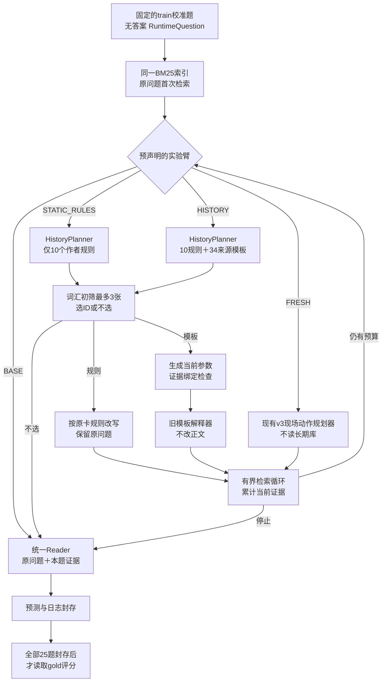

# 历史基底的在线代码

入口：`python -m growrag.experiments.history_calibration`。代码位于 `src/growrag/experiments/`，默认仅预检，不发API。

当前校准接口为显式`--version v2`，仅模板填参请求增加允许参数和可见证据清单；历史选择及其余方法没有改变。实验题段和对应评分题段由同一个版本配置登记，不能自行选择更有利的小段。

上图循环中的实验臂在每题开始时已经固定，循环不重新选择方法。修复臂总计最多3次检索、2次决策；重复查询、无新证据或主动停止可提前结束。本轮不训练路由器。

| 文件 | 一句话职责 |
|---|---|
| `history_calibration.py` | 数据/版本检查，四路执行，批次保护，失败落盘 |
| `history_runtime.py` | 初筛，选卡，规则改写，模板填参，独立本地输出合同 |
| `history_runtime_v2.py` | 只适配模板填参请求，列出允许名称/证据，仍严格拒绝非法输出 |
| `history_context.py` | 选择上下文与原卡执行绑定，防止选完换卡或换证据 |
| `history_library.py` | 冻结卡片、来源记录、候选与可调用状态 |
| `history_budget.py` | 继承旧项目账本并核对新请求 |
| `operator_loop.py` | 检索预算、重复查询、证据累积与停止 |
| `operator_model_v3.py` | 当前FRESH对照；并非原版S2G |
| `score_history_calibration.py` | 封存后评分与逐题诊断，不回写记忆 |

每个真实请求依次经过 `HistoryContractClient → DurableBudgetClient → LiveChatClient`，保存请求ID、原始请求响应、token和费用。服务端仅约束JSON语法，本地检查身份、类型、证据引用与执行预算。

完整用途、控制变量和阶段安排见 [25题开发实验方案](../experiments/2026-10-01_历史基底接通与25题开发实验.md)。
