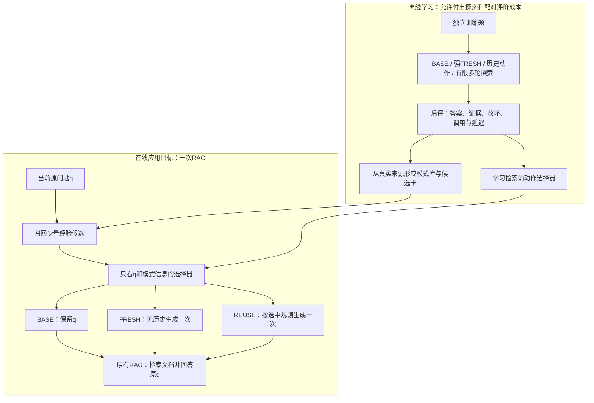

# 单次部署架构与创新边界

## 最需要掌握的 3 点

1. **学习时可以多尝试，部署时尽量只执行一次 RAG。** 多轮能力用于发现修复策略，不强制用户每次付出多轮成本。
2. **不做额外的首次检索，不等于不检索文档。** 前置层决定 query 后，原 RAG 仍执行必要的一次检索和回答。
3. **候选创新在选择依据及其学习方式，不是“有记忆＋QPP”的组合。** 要证明可观察条件帮助选择相对强 FRESH 有额外收益的动作。

## 目标架构：离线学习与在线应用分开

这是**目标方案，不是当前已运行架构**。当前批次正在补强无历史对照，还没有训练上图选择器。知识库保存答案用于审计不等于把历史答案提供给新题 Reader。

## 和“先生成多个query，再QPP”有什么区别

| 方案 | 选择器看到什么 | 节省什么 | 代价 |
|---|---|---|---|
| 先选动作再改写 | q、模式规则、条件、统计；没有Dk(q) | 省落选候选的改写与RAG | 必须预测一个尚未执行动作的价值，更难 |
| 多生成query后Pre-QPP | q及多个真实query；没有候选文档 | 省落选候选的完整RAG | 仍支付所有query生成与QPP成本 |
| ReFormeR式POST选模式 | q、首次检索文档、模式库 | 选择更有信息 | 先检索的时间/费用要单列 |

第一种更准确叫**检索前动作效用预测**，不能因为借鉴QPP就说是传统QPP原算法。第二种是后续成本对照；不要把两种选择器都堆成昂贵LLM调用，导致本来想省钱却更贵。

## 我们要证明什么

主假设：同一来源池、同一候选动作、同一底座和预算下，记录必要的可观察条件，比只给原题/摘要更能选择有益动作。

主要读数：相对强FRESH的净增量、救回数、损害数、实际复用比例、误拒有益经验的次数、token和总耗时。若从不复用，增量应为0，不能凭低损害宣称成功。

如果允许BASE回退，还必须比较“无历史BASE+FRESH选择策略”，而不是只和始终FRESH比；同候选数无历史多改写控制，排除多尝试本身的收益。

## 最接近的已有工作与比较位置

- [[GrowRAG - ReFormeR]]：规则与示例模式库，是主要历史模式对手；其POST上下文不能无说明地删掉。先做独立适配版，再考虑原数据原设置复现。
- [[GrowRAG - RRM]]：已有本题修复、历史适用性和动态维护；不能称这些机制首次出现。
- [[GrowRAG - QCR]]：已有memory−no-memory评价；我们选择端表示实验与其固定选中来源再改变执行端的位置不同，差异不自动意味着创新。
- [[GrowRAG - QPP Query Variant Selection]]：已有多query候选选一；需同候选和预算比较。

## 当前实验能回答与不能回答

这批32道新的selector_train题，比较BASE、旧简单FRESH、关键词式FRESH、伪文档扩写式FRESH。它回答“无历史起点应有多强、各自何时失效和花多少钱”。

它**不测历史收益、不训练最终选择器、不证明卡片表示优势**。结果是后面选择实验的强对照基础。原64来源六张卡不改，原8/24表示实验题不使用。

## 为什么暂时不急着叫完整Agentic RAG

离线探索可以体现Agent的观测—行动—反馈；部署版如果只有一次路由和一次RAG，论文应如实称经验驱动查询前置层，不能包装为已部署多轮Agent。多轮教师和单步学生是可以研究的安排，但仍需证明压缩后不损失关键能力。

关联：[[GrowRAG - 选择器学习方案]]、[[GrowRAG - 模式库与经验卡]]、[[GrowRAG - FRESH基线与阶段计划]]。

