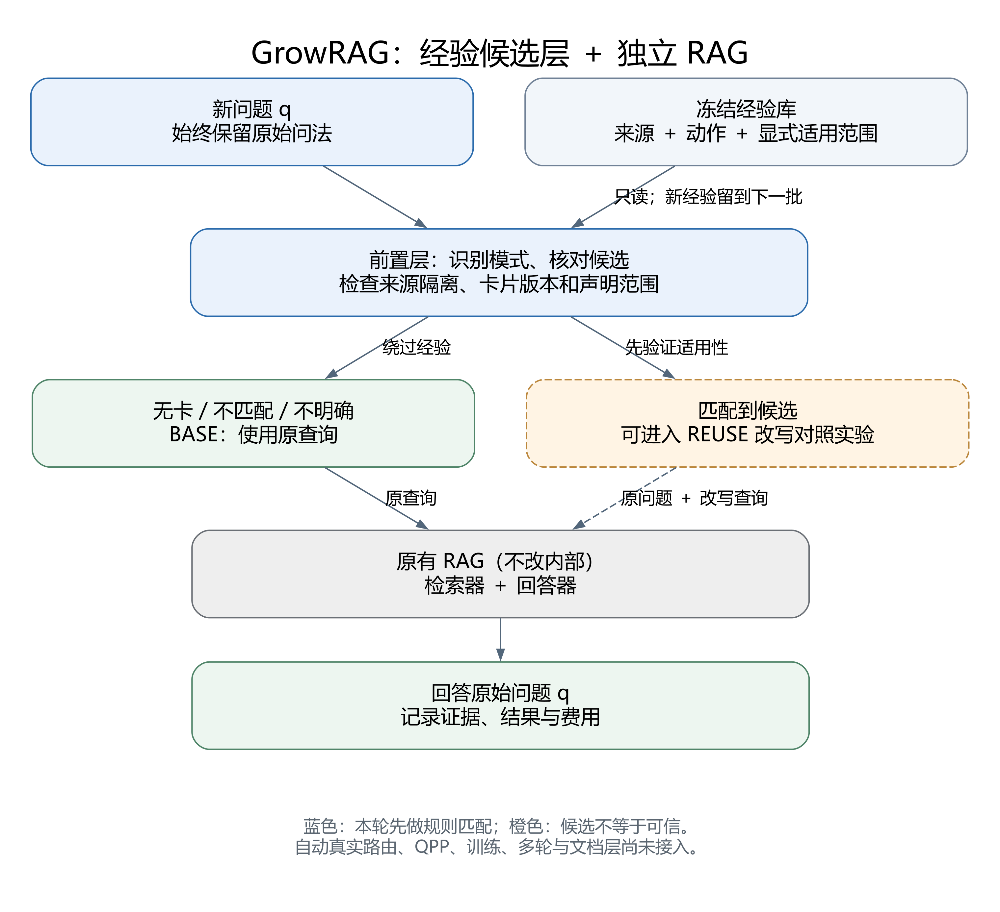

# 下一步与最小候选匹配：0.5.0

## Material Passport

- Origin Skill: experiment-agent；图示采用 Graphviz / engineering-figure-agent。
- Origin Mode: run（本地规则测试与离线诊断，不是模型效果检验）。
- Origin Date: 2026-09-07。
- Version Label: pattern_matcher_v1 / GrowRAG 0.5.0。
- Verification Status: VERIFIED for local execution only；不代表方法有效、语义支持或人类审核。

## 简单理解

**先找可能适用的经验，再验证它是否值得复用；没有把握，就保留原查询。**



当前不修改基础 RAG 的检索器、索引和回答器。前置层判断的是“哪些卡值得进入对照实验”，不是给所有问题自动改写。图中橙色虚线表示候选到真实调用尚未接通；旧批次仍使用原配置，不暗改结果。

## 后续顺序

1. **记对操作。** 用已有免费检索工具拆开查询成分，避免把“这题答对了”直接概括成“vs这个词有用”。有同样解释力的不同操作时，保留不确定性。
2. **找对候选。** 从“来源题和新题是否出现相同名字”前进到“新题在做什么、是否符合声明的范围”。本轮实现这一小步。
3. **验证是否值得用。** 在预先冻结、来源独立的新问题上比较 BASE、FRESH、REUSE，同时记录改善、退化和覆盖率。没有同类目标题时，不强套卡片凑分。
4. **有迁移信号后再学选择器。** 训练小模型或引入 QPP，替换手写规则；是否增加复杂度由独立数据的增量决定。

规则模板、SHA 指纹或模块组合本身不作为论文新颖性声明。将来要证明的是：经验中保留可检验操作及适用边界，是否比只存原查询对／泛化笔记更有利于跨题复用。本轮没有证明这个研究假设。

## 本轮代码做了什么

| 文件／概念 | 作用 | 不能据此声称什么 |
|---|---|---|
| `experience/pattern_matcher.py` 的 QueryPattern | 仅从新问题识别明确的两姓名年龄比较语法 | 不是通用意图模型或实体识别器 |
| ReviewedScope | 在原卡外附加显式的暂定适用范围，绑定全部视图字段和匹配器版本 | 不是模型自动批准，更不冒称用户已经审核 |
| match_reviewed_candidates | 核对来源隔离、阶段、动作、指纹、模式和范围，返回 CANDIDATE 或 BASE | CANDIDATE不是可信REUSE，不晋升或更新经验 |
| `experiments/pattern_probe.py` | 读取冻结视图，输出逐题选择理由；合成题和真实开发题分开 | 不运行检索、改写或回答，不产生答案分数 |

“年龄比较”是第一种有明确输入边界的测试样例，并不是研究范围只剩年龄问答。它覆盖 `Between A and B, who is older?`、`Who is younger, A or B?`、`Was A born earlier than B?` 等有限语法。其他表达返回 UNKNOWN（暂不能判断），本轮统一回 BASE。

简单姓名样式不保证真的是人名，也无法识别两个名字其实是同一个人。即使模式匹配，完整自然语言前提仍标为未验证，因此这个模块不直接触发真实调用。

### 为什么另外附一份范围声明

唯一真实卡从一次年龄比较概括到了年龄、身高等比较。我们不能让卡片自动扩大自己的权限。因此本轮不改卡片，另附一个明确标注 `developer_provisional` 的范围：只用于年龄比较候选诊断。这是开发代理的暂定配置，不是人工验证结果。

指纹包含全部 CardMemoryView 内容：版本、正文、源问题ID和哈希、阶段、动作等。任何字段变化，或匹配器版本变化，旧声明都不能继续使用，需要显式重新检查。这为之后“压缩经验后重新评估适用范围”提供机械边界，但目前没有自动压缩器。

## 实际执行了什么

本轮只有本地规则计算，没有读取 API 密钥，没有新增模型／检索／回答调用，没有训练参数。

- 9 道事先写明的合成边界题：3 个明确年龄比较进入候选；6 个否定、多对象、混合属性、作品年代或模糊问题回 BASE。仅说明接口符合这些测试预期，不报告泛化准确率。
- 原先已经曝光的16道内部开发题：0候选、16 BASE，仍然没有适用的年龄比较题。没有围绕这16题的实体或题号编写规则，也没有把零覆盖改成正结果。
- 原始冻结库不变；合成题和真实开发题分别统计。原始来源入库判断没有在此重新认证，读取的是已有编译视图。
- 专项测试62项通过：51项匹配器边界、11项诊断入口；全量695项通过，Ruff静态与格式检查通过。独立只读审查未发现必须修复的高优先问题；版本同步状态以项目当前记忆为准。

运行命令（已运行，旧输出不可覆盖）：

```powershell
.\.venv\Scripts\python.exe -m growrag.experiments.pattern_probe --library runs/2026-09-06_pre_pilot_32_16_v1/frozen_library.json --declare-age-scope pre-card-5a77bd595542995d83181291@v1 --manifest data/hotpotqa/train_preview_200_v1/manifest.json --output runs/2026-09-07_pattern_probe_v1/report.json
```

输出 `runs/2026-09-07_pattern_probe_v1/report.json` 包含范围声明、卡库哈希、匹配规则版本、逐题信号与拒绝原因；`api_requests=0`、`rag_calls=0`、`answer_effect=unknown`。

## 接下来先做什么，不急着做什么

下一小步是整理少量独立问题的“操作是否合适”标注规范，并为原查询对、简短操作笔记、带范围卡片准备相同的比较接口；真实批次题单、调用预算和报告口径需在结果前冻结。暂不把这个手写年龄规则推广到所有问题或变成论文方法。

QPP门控、小模型训练、在线可靠度/EMA、多轮修复和文档层继续后置。旧RAG内部不改，旧实验不重跑，下一批收费调用不包含在本轮零费用诊断内。

图的编辑源在 `figures/2026-09-07_pattern_routing/architecture.dot` 和 `.svg`；这是沟通用逻辑图，不是已经完成实验验证的论文终稿。
