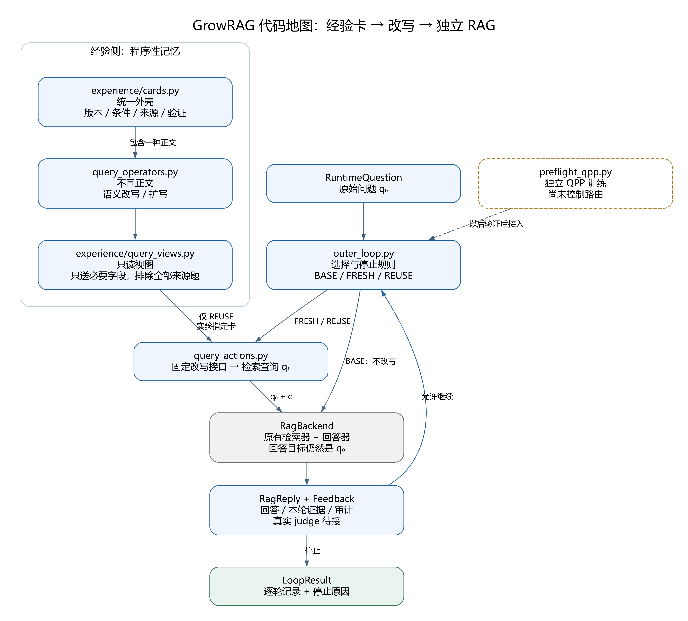

# 统一经验卡与当前代码地图

日期：2026-09-06。版本：GrowRAG 0.2.0；卡片格式 `experience_card.v1`。

用户已确认：**统一外壳，不同动作正文**。本轮将这个决定接入现有外置 RAG 循环，不另建一个庞大的 agent 框架。

## 1. 先看图，再看代码



[可编辑 SVG](../figures/2026-09-06_query_cards/code_architecture.svg)；[DOT 源图](../figures/2026-09-06_query_cards/code_architecture.dot)。图使用 Graphviz 精确绘制，保留文件名与未接入标记；不是论文效果图。

| 阅读顺序 | 文件 | 通俗理解 |
|---|---|---|
| 1 | `query_operators.py` | 两种不同的“操作说明书”：语义改写、扩写 |
| 2 | `experience/cards.py` | 给说明书加统一封面：版本、适用条件、来源和验证记录 |
| 3 | `experience/query_views.py` | 从整张卡中取出本次改写需要看的部分 |
| 4 | `query_actions.py` | 区分不改写、独立改写、参考经验改写；把输入送给模型接口 |
| 5 | `outer_loop.py` | 调用原 RAG，保存结果，决定停止或下一轮 |
| 独立支线 | `preflight_qpp.py` | 先前已经训练的小型检索效果预测，尚未用于自动选择 |

## 2. 统一的是什么，不同的是什么

同一张卡只包含一种动作正文，避免“统一”变成一个填满几十个可选字段的对象。

共同外壳继续使用 ExperienceCard：

- ID／版本：准确知道这次使用了哪一版经验。
- 适用条件／禁用条件：描述何时可能适合，何时应避免；语义改写允许没有 gap。
- 来源引用：保留全部来源 episode／turn，不只保留一个成功故事。
- 验证记录：保留收益、持平、退化等既有统计；不把统计送给改写器诱导它相信经验。
- 生命周期与父版本：区分候选、可用、隔离、退役；压缩改版不覆盖原卡。

正文有两种：

| 正文 | 存什么 | 为什么不通用成一句“请改写” |
|---|---|---|
| ParaphraseBody | `rewrite_rule` 转换规则；`preserve` 必须保留的内容 | 说明怎样换表达，同时不改变问题目标 |
| ExpansionBody | `term_roles` 补入词的类型；`grounding_rule` 绑定依据；是否要求当前证据 | 区分添加同义词与补入需要证据支持的实体、属性 |

“形式”和“目的”仍分开：术语对齐可以使用语义改写，也可以扩写；不是见到某个目的就硬编码唯一动作。拆分仍预留但不可执行，后面明确多查询预算与依赖再加。

下列是手写结构示例，不是模型产生或验证成功的经验：

```python
semantic = RepairSpecification(
    operator_type="paraphrase",
    slot_template=None,
    evidence_contract="Preserve the original objective and retrieve relevant support.",
    action_body=ParaphraseBody(
        rewrite_rule="Express a founding question as a founder noun phrase.",
        preserve=("entity", "relation direction", "time", "negation"),
    ),
    intent="terminology alignment",
)

expansion = RepairSpecification(
    operator_type="expand",
    slot_template=None,
    evidence_contract="New evidence should connect the grounded entity to the requested relation.",
    action_body=ExpansionBody(
        term_roles=("grounded entity alias", "relation synonym"),
        grounding_rule="Bind factual additions only from the current question or evidence.",
        requires_current_evidence=True,
    ),
    intent="add evidence-grounded search terms",
)
```

旧 `slot_template` 保持旧卡可读；新 typed body 用它替代模板，不能同时保存两套互相矛盾的操作说明。旧卡不是改个版本号就自动成为新卡：需显式改版，验证记录重新开始。

## 3. 卡片怎样进入实际代码流程

```text
已有来源 episode + 一张实验指定卡
  → card_to_view：核对所有来源，只摘取必要字段
  → diagnostic_reuse_decision：从卡确定形式与目的
  → APISingleQueryGenerator：固定版本 prompt 生成一个检索查询
  → RagBackend：检索用新查询，回答仍对准原问题
  → LoopResult：保存逐轮结果、费用和停止原因
```

`card_to_view` 要求给出每个来源 episode 对应的 RuntimeQuestion，并核对归档中的原问题与来源修复步骤。它排除所有来源题；换一个 ID 但文本只是大小写／空白变化，也不能冒充新题。

在线视图只含程序性正文、条件和来源标识，不把历史答案、历史问题正文、文档内容、gold 事件或验证分数复制进改写输入。自由文本里的语义泄漏仍需审计，字段白名单不是语义正确性证明。

这条新链使用 `growrag-outer-typed-card-v1` prompt 版本。旧纯文本实验保持旧格式／旧 prompt；旧 APIRewriter 明确拒绝 typed card，避免它误用仅面向 gap 的旧提示词。

重要边界：这是**实验预选卡的接通**，不是自动可信路由。候选卡可以在明确设置的离线实验中读取以积累验证；这不允许它绕过原 registry 的 ACTIVE 门槛进入生产。零验证改版卡仍不能注册为已验证可服务卡。

目前硬检查的是：来源隔离、形式／正文一致、前置／后置阶段、必要当前证据、显式检索能力、隔离与退役状态。自然语言适用条件只是传入新版 prompt，没有被程序自动理解或证明成立。自动匹配和“值得用”的判断器是下一步。

## 4. 已经实现，不代表已经证明有效

本轮新增：

1. 两种不可变动作正文与统一 v1 卡外壳。
2. 无 gap 的语义改写；扩写有独立的术语类型和依据。
3. 多来源、版本化的只读视图及新改写入口。
4. 运行前拦截错误形式、错阶段、缺必要证据和来源题复用。
5. 保留旧 prompt／旧实验，补齐 GitHub 测试所需的可选 QPP 依赖。

保留但尚未完成：自动经验召回与适用判断、真实 judge 接入新循环、相对 FRESH 的收益选择器、自动压缩与动态更新、拆分、文档层。

测试使用显式 mock transport，验证真实代码接口和错误处理，但模型输出是测试替身提供的。不能把通过率当成答案准确率。本轮不读取 API 密钥、不运行付费模型、不下载新数据、不重新训练；上一轮 QPP 结果仍仅是工程诊断。

本地完整测试 424 项通过，其中本轮新增 42 项卡片专项测试；Ruff 静态检查与格式检查通过。独立审计发现的重复 JSON 键歧义已修复，并覆盖顶层／正文／条件三种嵌套位置，避免程序校验与模型阅读出现两种解释。

## 5. 目标和下一步

工程目标：让不同经验写法在同一套可追溯执行流程下接受比较，而不是为每种卡重写一套 RAG。

研究目标：一条经验带着什么前提，在什么新问题上，能比本题独立 FRESH 改写多带来收益；什么情况下应该不用它。统一外壳与多动作不是单独创新。

接下来先固定一种语义改写形式，构建同题 BASE／FRESH／REUSE 的逐题比较。第一步比较查询、实际支持证据、答案和费用；第二步才用隔离的训练题学习是否值得复用。暂不把动作拆分、记忆合并、多轮学习同时引入。

需要用户审阅的三个点：两种正文是否表达清楚“怎么做”；视图是否保留了选择所需前提而没有混入历史事实；原问题／搜索查询／经验三者边界是否符合你的预期。

## 6. 本地验证与版本控制

在项目根目录执行：

```powershell
.\.venv\Scripts\python.exe -m pytest
.\.venv\Scripts\python.exe -m ruff check src tests scripts
.\.venv\Scripts\python.exe -m ruff format --check src tests scripts
```

新机器安装测试环境使用 `pip install -e ".[dev,qpp]"`；`qpp` 只增补小回归模型的依赖，不强装整个实验工具栈。运行流程测试不需要 API Key。

分支：`codex/query-card-actions-v1`；研究版标签：`v0.2.0-research.1`。先用 `ff1da96` 保存上一轮外循环／QPP／图稿检查点，再单独提交本轮卡片动作变更。不强推，不自动合并 main；本地密钥、原始数据、运行日志和模型参数继续忽略。
